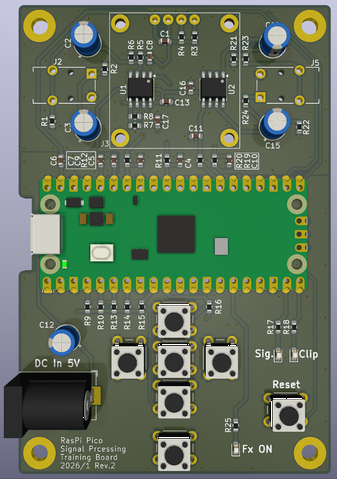
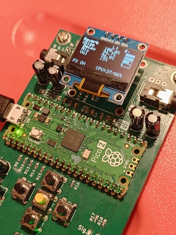

Raspberry Pi Pico2 でつくる簡単エフェクターです。  
KiCadプロジェクトは本リポジトリ、Raspberry Pi Pico2 のソフトウェアは [RasPiPico2Effector_Software](https://github.com/toripoyo/RasPiPico2Effector_Software) を参照してください。

## スペック

| パラメータ | 値 |
|-----------|-------|
| MCU | RP2350 (Cortex-M33) @ 250 MHz |
| サンプリングレート | 約44.1 kHz|
| オーバーサンプリング | 4倍 |
| 信号処理ブロックサイズ | 16サンプル |
| ADC分解能 | 12ビット |
| PWM分解能 | 11ビット |
| PWM周波数 | 約122 kHz (250 MHz / PWM分解能) |
| Core 0 | ADC入力/DMA、PWM出力、UI/ディスプレイ |
| Core 1 | オーディオエフェクト処理 |

※ in/out のアナログLPFはfc=15kHzです。

## 操作方法
- On/Thru: エフェクトOn/Off
- Enter: エフェクト種類の切り替え
- Up/Down: 操作パラメータ選択
- Left/Right: パラメータ変更

## 書き込み方法
Reset ボタンを押しながら、RasPi Pico上のBOOTSELボタンを押し、PCからストレージとして認識される状態にしてください。

## ライセンス
[LICENSE](./LICENSE)